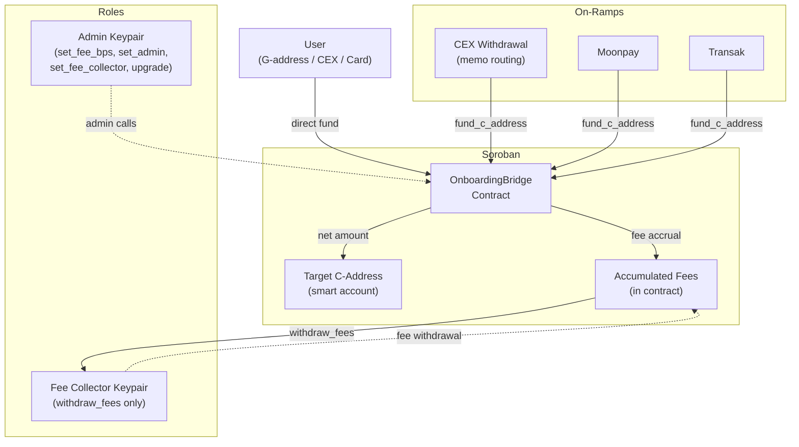
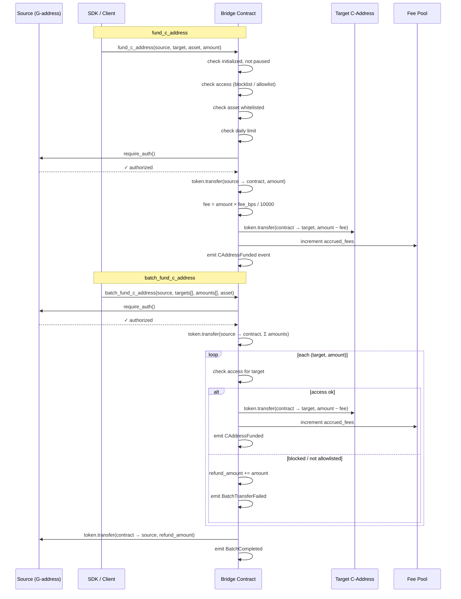
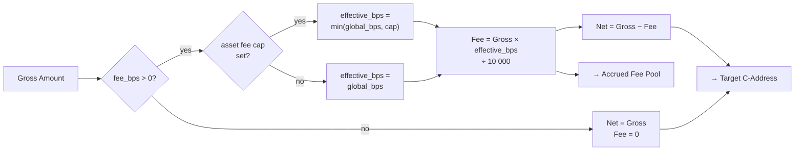
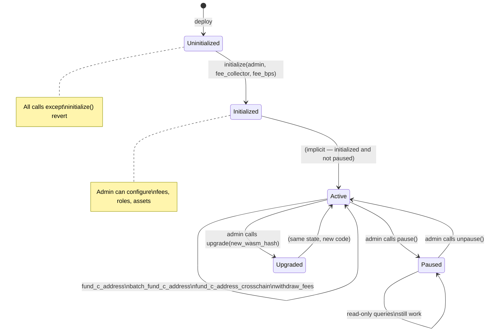

# C-Address Onboarding Bridge

A Soroban smart contract + TypeScript SDK that lets anyone fund a Soroban smart account (C-address) directly — from a CEX withdrawal, a credit card, or an existing G-address — without the user needing to understand the underlying account model.

## Architecture



### Contract (`contracts/onboarding-bridge/`)

| Function | Description |
|---|---|
| `initialize` | Set admin, fee collector, and fee rate |
| `fund_c_address` | Route tokens from source to a C-address |
| `batch_fund_c_address` | Fund multiple C-addresses in one tx |
| `set_fee_bps` / `set_fee_collector` / `set_admin` | Admin management |
| `withdraw_fees` | Fee collector drains accumulated fees |
| `query_fee_bps` / `query_fee_collector` / `query_admin` | Read config |
| `query_balance` | Check any address's token balance |
| `query_is_initialized` | Check if contract is initialized |

### Transaction Flow



### Fee Calculation



### Contract State Machine



### Contract (`contracts/onboarding-bridge/`)

| Function | Description |
|---|---|
| `initialize` | Set admin, fee collector, and fee rate |
| `fund_c_address` | Route tokens from source to a C-address |
| `batch_fund_c_address` | Fund multiple C-addresses in one tx |
| `set_fee_bps` / `set_fee_collector` / `set_admin` | Admin management |
| `withdraw_fees` | Fee collector drains accumulated fees |
| `query_fee_bps` / `query_fee_collector` / `query_admin` | Read config |
| `query_balance` | Check any address's token balance |
| `query_is_initialized` | Check if contract is initialized |

### SDK (`sdk/`)

- `OnboardingBridgeSDK` — Wraps all contract calls, handles tx building/signing
- `OffRampIntegration` — Moonpay/Transak URL generation + CEX memo encoding

## Quick Start

### Build Contract

```bash
cargo build -p onboarding-bridge --release
```

### Run Tests

```bash
cargo test -p onboarding-bridge --features testutils
```

### Deploy to Testnet

1. Build WASM:
```bash
cargo build -p onboarding-bridge --release --target wasm32-unknown-unknown
```

2. Create `deploy-config.json`:
```json
{
  "rpcUrl": "https://soroban-testnet.stellar.org",
  "networkPassphrase": "Test SDF Network ; September 2015",
  "adminSecretKey": "S...",
  "feeCollectorPublicKey": "G...",
  "feeBps": 50,
  "wasmPath": "./target/wasm32-unknown-unknown/release/onboarding_bridge.wasm"
}
```

3. Deploy and initialize:
```bash
npx ts-node scripts/deploy.ts all
```

### Use the SDK

```ts
import { OnboardingBridgeSDK, OffRampIntegration } from '@stellar/c-address-onboarding-bridge-sdk';

const bridge = new OnboardingBridgeSDK({
  contractId: 'C...',
  rpcUrl: 'https://soroban-testnet.stellar.org',
  networkPassphrase: 'Test SDF Network ; September 2015',
});

const result = await bridge.fundCAddress(
  { source: 'G...', target: 'C...', asset: 'C...', amount: '1000' },
  sourceKeypair,
);

// Credit card on-ramp
const offramp = new OffRampIntegration({ testMode: true });
const moonpayUrl = offramp.getMoonpayUrl({
  targetCAddress: 'C...',
  amount: '100',
  currency: 'XLM',
});

// CEX deposit routing
const memo = offramp.generateCEXDepositMemo('C...');
```

## Fee Model

Fees are configured in basis points (bps, 1/10000 of 1%). Max 1000 bps (10%).
Fees accumulate in the contract and are withdrawn by the fee collector.

## Events

- `CAddressFunded` — emitted on each fund/batch transfer
- `FeesWithdrawn` — emitted when fees are withdrawn

---

## Production Deployment Guide

### Prerequisites

- **XLM for deployment**: You need at least ~10 XLM in your admin account to cover the WASM upload fee (~5–7 XLM) and contract instantiation (~0.1 XLM). Keep extra for ongoing admin transactions.
- **Soroban RPC endpoint**: Use a reliable production RPC. Options:
  - Self-hosted: run `stellar-core` + `soroban-rpc`
  - Hosted: [Ankr](https://www.ankr.com/rpc/stellar/), [NOWNodes](https://nownodes.io/), or a dedicated provider
- **Admin keypair**: A dedicated keypair for contract administration. Never reuse a hot wallet. Store the secret key in a secrets manager (AWS Secrets Manager, HashiCorp Vault, etc.).
- **Fee collector keypair**: A separate keypair from admin, used only for fee withdrawals.
- **Rust + wasm32 target**: `rustup target add wasm32-unknown-unknown`

### Step-by-Step Deployment

#### 1. Build the WASM

```bash
cargo build -p onboarding-bridge --release --target wasm32-unknown-unknown
```

The compiled artifact will be at:
```
target/wasm32-unknown-unknown/release/onboarding_bridge.wasm
```

#### 2. Install WASM on the Network

Upload the compiled WASM bytecode to Stellar. This is separate from creating a contract instance and only needs to be done once per version.

```bash
stellar contract install \
  --network mainnet \
  --source admin-keypair \
  --wasm target/wasm32-unknown-unknown/release/onboarding_bridge.wasm
```

This prints a `wasm_hash` — save it, you'll need it for instantiation and future upgrades.

#### 3. Create a Contract Instance

```bash
stellar contract deploy \
  --network mainnet \
  --source admin-keypair \
  --wasm-hash <WASM_HASH_FROM_STEP_2>
```

This prints the contract's C-address. Save it as `CONTRACT_ID`.

#### 4. Initialize the Contract

```bash
stellar contract invoke \
  --network mainnet \
  --source admin-keypair \
  --id <CONTRACT_ID> \
  -- initialize \
  --admin <ADMIN_G_ADDRESS> \
  --fee_collector <FEE_COLLECTOR_G_ADDRESS> \
  --fee_bps 50
```

- `fee_bps`: fee in basis points (50 = 0.5%). Max allowed is 1000 (10%).
- This can only be called once. The contract will reject a second `initialize` call.

Alternatively, use the deploy script which handles steps 2–4 in one command:

```bash
# deploy-config.json (production)
{
  "rpcUrl": "https://your-rpc-endpoint.com",
  "networkPassphrase": "Public Global Stellar Network ; September 2015",
  "adminSecretKey": "<loaded from secrets manager, not hardcoded>",
  "feeCollectorPublicKey": "G...",
  "feeBps": 50,
  "wasmPath": "./target/wasm32-unknown-unknown/release/onboarding_bridge.wasm"
}

npx ts-node scripts/deploy.ts all
```

### Post-Deployment Verification

Confirm the contract is live and correctly initialized:

```ts
import { OnboardingBridgeSDK } from '@stellar/c-address-onboarding-bridge-sdk';
import { Networks } from '@stellar/stellar-sdk';

const sdk = new OnboardingBridgeSDK({
  contractId: process.env.CONTRACT_ID!,
  rpcUrl: process.env.RPC_URL!,
  networkPassphrase: Networks.PUBLIC,
});

const initialized = await sdk.isInitialized();
console.assert(initialized, 'Contract not initialized');

const admin = await sdk.getAdmin();
console.assert(admin === process.env.EXPECTED_ADMIN, `Admin mismatch: ${admin}`);

const feeBps = await sdk.getFee();
console.assert(feeBps === 50, `Fee mismatch: ${feeBps}`);

const feeCollector = await sdk.getFeeCollector();
console.log('Verified. Fee collector:', feeCollector);
```

### Setting Up Monitoring (Event Listeners)

Subscribe to on-chain contract events to track all bridge activity:

```ts
import { SorobanRpc, xdr, scValToNative } from '@stellar/stellar-sdk';

const server = new SorobanRpc.Server(process.env.RPC_URL!);

async function pollEvents(contractId: string, cursor = 'now') {
  const { events } = await server.getEvents({
    startLedger: cursor === 'now' ? undefined : Number(cursor),
    filters: [
      {
        type: 'contract',
        contractIds: [contractId],
        topics: [['*']],
      },
    ],
    limit: 100,
  });

  for (const event of events) {
    const topic = scValToNative(event.topic[0] as xdr.ScVal);
    const value = scValToNative(event.value);

    if (topic === 'CAddressFunded') {
      console.log('Fund event:', value);
      // alert, log to DB, update dashboard, etc.
    } else if (topic === 'FeesWithdrawn') {
      console.log('Fee withdrawal:', value);
    }
  }

  // Return the cursor for the next poll
  return events.length > 0 ? events[events.length - 1].pagingToken : cursor;
}

// Poll every 5 seconds
let cursor = 'now';
setInterval(async () => {
  cursor = await pollEvents(process.env.CONTRACT_ID!, cursor);
}, 5000);
```

For production, use a persistent queue (e.g., SQS, Redis Streams) rather than in-process polling to survive restarts without missing events.

### Setting Up a Fee Withdrawal Schedule

Automate fee collection on a regular cadence (e.g., daily via cron):

```ts
import { OnboardingBridgeSDK } from '@stellar/c-address-onboarding-bridge-sdk';
import { Keypair, Networks } from '@stellar/stellar-sdk';

async function withdrawAccumulatedFees() {
  const sdk = new OnboardingBridgeSDK({
    contractId: process.env.CONTRACT_ID!,
    rpcUrl: process.env.RPC_URL!,
    networkPassphrase: Networks.PUBLIC,
  });

  const feeCollectorKeypair = Keypair.fromSecret(
    process.env.FEE_COLLECTOR_SECRET!, // load from secrets manager
  );

  // Check balance before withdrawing
  const balance = await sdk.getFeeBalance(process.env.USDC_ASSET_CONTRACT!);
  if (BigInt(balance) === 0n) {
    console.log('No fees to withdraw');
    return;
  }

  const result = await sdk.withdrawFees(
    { asset: process.env.USDC_ASSET_CONTRACT!, amount: balance },
    feeCollectorKeypair,
  );

  if (result.status === 'failed') {
    console.error('Withdrawal failed:', result.error);
    // trigger alert
  } else {
    console.log('Withdrew fees. Tx:', result.hash);
  }
}
```

### Security Considerations for Production

**Key management**
- Store all secret keys in a secrets manager (AWS Secrets Manager, HashiCorp Vault). Never commit keys to version control or pass them via environment variables in CI.
- Use separate keypairs for admin and fee collector roles. Compromise of the fee collector key cannot change contract configuration.
- Consider a multisig setup for the admin key using Stellar's threshold/signer model.

**Access control**
- The admin keypair can change fee rate, fee collector, and admin address. Treat it with the same care as a root credential.
- Rotate admin and fee collector keys periodically. Use `sdk.setAdmin()` and `sdk.setFeeCollector()` to perform the rotation atomically.

**Contract upgrades**
- Keep the deployed WASM hash in version control alongside the source. Before upgrading, verify the new WASM hash corresponds to audited source.
- Test all upgrades on testnet first with identical configuration.

**RPC endpoint**
- Use an RPC endpoint you control or a paid provider with SLA guarantees. A failing RPC means failed transactions, not data loss, but causes service degradation.
- Implement retry logic with exponential backoff for transient RPC failures.

**Fee rate**
- The contract enforces a max of 1000 bps (10%). Set fee_bps conservatively; changes take effect on the next transaction.

### Disaster Recovery Plan

**Scenario: admin key compromised**
1. Immediately call `set_admin` from the compromised key to transfer admin to a freshly generated keypair stored offline.
2. If you cannot reach the key in time, the contract will continue operating with the compromised key in control — treat this as a security incident, rotate fee collector as well.
3. Communicate with your integration partners to pause new funding flows while recovery is in progress.

**Scenario: RPC outage**
1. Switch `rpcUrl` to a backup RPC endpoint. No contract state is affected.
2. Keep at least one backup RPC URL in your config.

**Scenario: contract bug found after deployment**
1. The contract supports in-place upgrades via `upgrade()` (admin only). Build and audit a patched WASM, install it on-chain, then call `upgrade` with the new wasm hash.
2. All instance storage (admin, fee config, accumulated fees) is preserved across upgrades.
3. If the bug allows draining funds before you can upgrade, use `reclaimTokens()` to move tokens to a safe address.

**State backup**
- The contract's on-chain state (Stellar ledger) is the source of truth. No off-chain backup is needed for contract state, but maintain your own database of funding events for reporting and reconciliation using the event listener above.

---

## SDK Integration Guide

### Installation

```bash
npm install @stellar/c-address-onboarding-bridge-sdk @stellar/stellar-sdk
```

### Basic Setup

```ts
import { OnboardingBridgeSDK, OffRampIntegration } from '@stellar/c-address-onboarding-bridge-sdk';
import { Keypair, Networks } from '@stellar/stellar-sdk';

const sdk = new OnboardingBridgeSDK({
  contractId: 'CA...', // deployed contract C-address
  rpcUrl: 'https://soroban-mainnet.stellar.org',
  networkPassphrase: Networks.PUBLIC,
  timeout: 30, // optional, seconds
});
```

### Funding a C-Address

```ts
const sourceKeypair = Keypair.fromSecret(process.env.SOURCE_SECRET!);

const result = await sdk.fundCAddress(
  {
    source: sourceKeypair.publicKey(), // G-address
    target: 'CC...',                   // destination C-address
    asset: 'CD...',                    // token contract address (e.g. USDC)
    amount: '10000000',                // in smallest unit (7 decimals for USDC → 1 USDC)
  },
  sourceKeypair,
);

if (result.status === 'failed') {
  console.error('Transfer failed:', result.error);
} else {
  console.log('Transaction submitted:', result.hash);
}
```

### Batch Funding Multiple C-Addresses

```ts
const result = await sdk.batchFundCAddresses(
  {
    source: sourceKeypair.publicKey(),
    targets: ['CC...1', 'CC...2', 'CC...3'],
    amounts: ['5000000', '3000000', '2000000'], // must match targets length
    asset: 'CD...',
  },
  sourceKeypair,
);
```

### Error Handling

All mutating methods return a `TransactionResult` and never throw — check `status` and `error`:

```ts
const result = await sdk.fundCAddress(options, keypair);

switch (result.status) {
  case 'pending':
    // Transaction is in the mempool. Poll for confirmation using result.hash.
    break;
  case 'failed':
    // Transaction was rejected. Inspect result.error for the reason.
    console.error(result.error);
    break;
}
```

Read-only methods (`getFee`, `getAdmin`, `getCAddressBalance`, etc.) throw on RPC or contract error — wrap them in try/catch:

```ts
try {
  const balance = await sdk.getCAddressBalance('CC...', 'CD...');
  console.log('Balance:', balance);
} catch (err) {
  console.error('Query failed:', err);
}
```

### Querying Contract State

```ts
// Check initialization status
const initialized = await sdk.isInitialized();

// Read configuration
const feeBps       = await sdk.getFee();          // e.g. 50
const admin        = await sdk.getAdmin();         // G-address
const feeCollector = await sdk.getFeeCollector();  // G-address

// Check balances
const userBalance  = await sdk.getCAddressBalance('CC...', 'CD...');
const feeBalance   = await sdk.getFeeBalance('CD...');
const allBalances  = await sdk.getAllBalances(['CD...usdc', 'CD...xlm']);
// allBalances: { 'CD...usdc': '1200000', 'CD...xlm': '500000000' }
```

### Admin Operations

```ts
const adminKeypair = Keypair.fromSecret(process.env.ADMIN_SECRET!);

// Update fee rate (max 1000 bps)
await sdk.setFee(75, adminKeypair);

// Rotate fee collector
await sdk.setFeeCollector('G...newCollector', adminKeypair);

// Transfer admin role
await sdk.setAdmin('G...newAdmin', adminKeypair);

// Recover accidentally sent tokens
await sdk.reclaimTokens(
  { asset: 'CD...', amount: '1000000', to: 'G...safeAddress' },
  adminKeypair,
);

// Upgrade contract to a new wasm (get hash from `stellar contract install`)
await sdk.upgrade({ newWasmHash: 'abcdef...' }, adminKeypair);
```

### Fee Withdrawal

```ts
const feeCollectorKeypair = Keypair.fromSecret(process.env.FEE_COLLECTOR_SECRET!);

const feeBalance = await sdk.getFeeBalance('CD...');

await sdk.withdrawFees(
  { asset: 'CD...', amount: feeBalance },
  feeCollectorKeypair,
);
```

### Credit Card On-Ramp (Moonpay / Transak)

```ts
const offramp = new OffRampIntegration({
  moonpayApiKey: process.env.MOONPAY_API_KEY,
  transakApiKey: process.env.TRANSAK_API_KEY,
  testMode: false, // true → sandbox URLs
});

// Moonpay: user pays with credit card, funds arrive at C-address
const moonpayUrl = offramp.getMoonpayUrl({
  targetCAddress: 'CC...',
  amount: '100',       // fiat amount
  currency: 'XLM',    // crypto currency code
  assetCode: 'USD',   // optional fiat currency
});
// Redirect or open moonpayUrl in a browser/webview

// Transak
const transakUrl = offramp.getTransakUrl({
  targetCAddress: 'CC...',
  amount: '100',
  currency: 'XLM',
  fiatCurrency: 'USD', // optional
});
```

### CEX Deposit Routing

For users depositing from a centralized exchange, generate a memo they include with their withdrawal:

```ts
// Encode target C-address into a Stellar memo
const memo = offramp.generateCEXDepositMemo('CC...');
// → "bridge:CC..."

// Decode on receipt
const target = offramp.decodeCEXDepositMemo(memo);
// → "CC..."
if (!target) {
  console.error('Invalid bridge memo');
}
```

### Event Listening

```ts
import { SorobanRpc, scValToNative } from '@stellar/stellar-sdk';

const server = new SorobanRpc.Server(process.env.RPC_URL!);

const { events } = await server.getEvents({
  startLedger: latestLedger,
  filters: [{ type: 'contract', contractIds: [process.env.CONTRACT_ID!] }],
  limit: 100,
});

for (const event of events) {
  const [topicVal, ...rest] = event.topic;
  const eventName = scValToNative(topicVal);
  const data = scValToNative(event.value);

  if (eventName === 'CAddressFunded') {
    // data: { source, target, asset, amount, fee }
    console.log('Funded:', data);
  } else if (eventName === 'FeesWithdrawn') {
    console.log('Fees withdrawn:', data);
  }
}
```

### Best Practices

- **Amount precision**: all amounts are in the token's smallest unit. USDC uses 7 decimal places, so `1 USDC = 10_000_000`.
- **Transaction confirmation**: `fundCAddress` returns `status: 'pending'` on submission. Poll `SorobanRpc.Server.getTransaction(hash)` to confirm finality before showing success to users.
- **Keypairs**: never instantiate keypairs from hardcoded secrets. Load from environment variables or a secrets manager at runtime.
- **Network passphrase**: always use `Networks.PUBLIC` for mainnet and `Networks.TESTNET` for testnet. Mismatches cause immediate transaction rejection.
- **RPC retries**: wrap SDK calls in retry logic for transient network failures. The SDK does not retry automatically.

## License

MIT
